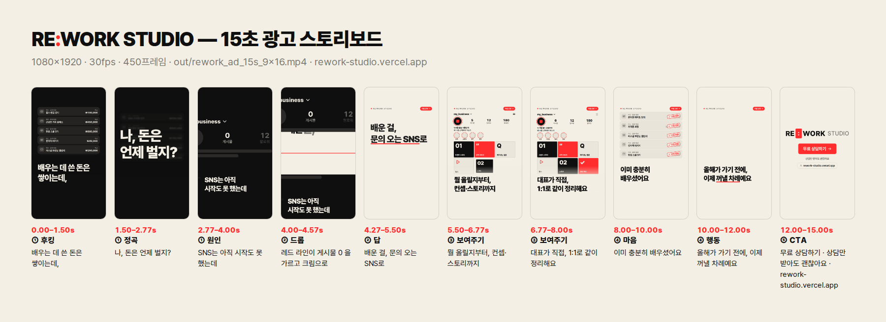

# RE:WORK STUDIO — 15초 광고 영상 (인스타 릴스 · 메타 광고)

**결과물**: [`out/rework_ad_15s_9x16.mp4`](out/rework_ad_15s_9x16.mp4)
1080×1920 (9:16) · 30fps · 정확히 15.00초 (450프레임) · H.264 High · AAC 48kHz 스테레오 · -16 LUFS



HTML/CSS/JS 로 만든 애니메이션을 헤드리스 Chromium 에서 프레임 단위(0~449)로 캡처해 ffmpeg 로 인코딩합니다.
화면은 프레임 번호만으로 결정되고(시간·랜덤에 의존하지 않음) BGM·효과음도 코드로 합성하므로, 몇 번을 렌더해도 같은 결과가 나옵니다.

## 사용법

```bash
cd rework-ad
npm install
npx playwright install chromium   # 처음 한 번만 (헤드리스 브라우저)
npm run render                    # 검사 → BGM 합성 → 450프레임 캡처 → mp4
```

| 명령 | 하는 일 |
|---|---|
| `npm run render` | 검사를 통과하면 `out/rework_ad_15s_9x16.mp4` + `out/contact_sheet.png`(0.5초 간격 30컷) 생성 |
| `npm run check` | 문장 노출 시간(1.2초 이상)과 인스타 UI 영역 침범 여부만 검사 |
| `npm run stills` | 주요 장면 9컷(`out/stills/`) + 스토리보드 이미지(`out/storyboard.png`) |
| `npm run preview` | 브라우저 미리보기: 재생·탐색·인스타 UI 영역 표시. config.js 를 고치고 새로고침하면 바로 반영 |
| `npm run audio` | BGM 만 다시 합성 (`out/audio.wav`) |

## 문구·타이밍·컬러 바꾸기: `config.js` 한 파일만 고치면 됩니다

- **문구**
  - `scenes` 안의 `text`(자막), `payments`(결제 알림), `captions`, `button`, `note`, `url` 등을 고칩니다.
  - `profile`(연출용 계정 화면)과 `brand`(상단 브랜드 표기)도 여기서 바꿉니다.
  - 줄바꿈은 배열로 나눠 적습니다.
- **강조 표기**: `{단어}` 는 빨간 밑줄입니다. '문의 오는 SNS' 밑줄은 화면을 가른 레드 라인이 그대로 내려앉은 것입니다.
- **타이밍**
  - 모두 초 단위입니다. 각 장면은 다음 장면의 `start` 에서 끝납니다.
  - 음악의 스톱타임·드롭·브레이크다운·빌드업도 장면 시작 시간을 따라갑니다.
  - BGM 이 120BPM(1박 = 0.5초)이라 0.25초 단위로 맞추면 박자에 붙습니다.
- **컬러**: `colors.ink / cream / red`. 화면의 모든 색은 이 3색과 그 투명도로만 만들어집니다.
- **소리**: `audio.loudness`(LUFS), `audio.volume`, `audio.sfx`(효과음 켜고 끄기).
- **카피 톤**
  - 1인칭 속마음("나, 돈은 언제 벌지?")으로 씁니다.
  - "돈 없으시죠?"처럼 보는 사람의 재정 상태를 단정하는 문구는 메타 광고 정책(개인 특성)에 걸릴 수 있습니다.

문구가 길어지면 폭에 맞게 글자 크기가 자동으로 줄어듭니다. 문장 노출이 1.2초보다 짧아지거나 핵심 텍스트가 상단 250px·하단 350px(인스타 UI 영역)을 침범하면 렌더를 멈추고 어느 문장이 문제인지 알려줍니다(`--force` 로 강제 진행 가능).

## 스토리보드 (30fps, 120BPM에서 1박 = 15프레임)

**앞 5초 안에 아픔 → 원인 → 답 → 브랜드·무료 상담까지 전부 보여줍니다.** 뒤 10초는 끝까지 본 사람을 위한 증명과 마음, CTA 입니다.

| 시간 | 장면 | 화면 (계속 움직임) | 자막 | 소리 |
|---|---|---|---|---|
| 0.0–1.5s | ① 후킹 | 블랙. 강의·자격증·챌린지·'SNS 수익화 강의' 결제 알림이 폭포처럼 쌓임 (첫 프레임부터 4장) | 배우는 데 쓴 돈은 / 쌓이는데, | 0초 임팩트, 결제음, A단조 인트로 |
| 1.5–2.75s | ① 정곡 | 음악이 멈추고 배경이 얼어붙듯 흐려짐. 거대한 글자가 한 단어씩 떨어지며 화면이 흔들림 | 나, 돈은 / 언제 벌지? | 스톱타임 + 단어마다 타격음 |
| 2.75–4.0s | ① 원인 | 휩팬으로 내 계정 → '게시물 0' 으로 2배 줌 펀치 | SNS는 아직 / 시작도 못 했는데 | 휩, 스네어 롤, 라이저 |
| 4.0–5.5s | ② 답 | **드롭.** 레드 라인이 화면을 가르고 크림으로. 라인이 '문의 오는 SNS' 밑줄로 내려앉음. 상단에 `● RE:WORK STUDIO` + `[무료 상담 →]` | 배운 걸, / 문의 오는 SNS로 | A장조 드롭 (임팩트·크래시) |
| 5.5–8.0s | ③ 보여주기 | 같은 계정이 정리되며 채워짐: 소개글·하이라이트, 게시물 타일이 박자마다 톡톡 (0 → 6) | 뭘 올릴지부터, 컨셉·스토리까지 → 대표가 직접, 1:1로 같이 정리해요 | 하우스 그루브, 타일마다 플럭 |
| 8.0–10.0s | ④ 마음 | 결제했던 강의 카드들이 가지런히 쌓이고 하나씩 빨간 '수강 완료' 도장 | 이미 충분히 / 배우셨어요 | 브레이크다운 (드럼 빠짐), 도장 소리 |
| 10.0–12.0s | ④ 행동 | 쌓인 카드가 하나씩 위로 날아감 (꺼내기) | 올해가 가기 전에, / 이제 꺼낼 차례예요 | 두 번째 빌드업, 카드 휙휙 |
| 12.0–15.0s | ⑤ CTA | 로고가 꽝 → 빨간 **무료 상담하기 →** 버튼(눌림) → 안심 문구 → 주소 | 상담만 받아도 괜찮아요 · rework-studio.vercel.app | CTA 드롭 + 차임 → 으뜸화음 |

**카피 설계**
- **정곡**
  - 배우는 데 돈은 쓰는데 수익은 없고 SNS 는 시작도 못 한 사람의 속마음을 1인칭으로 찌릅니다.
  - 결제 알림 속 'SNS 수익화 강의'는 수익화 강의까지 샀는데 게시물은 0 이라는 대비입니다.
- **답**: "배운 걸, 문의 오는 SNS로". 랜딩 페이지의 "콘텐츠가 조회수가 아니라 신뢰와 문의로 이어지도록" 을 광고 한 줄로 줄였습니다.
- **증명**: 비어 있던 같은 계정이 정리되는 전후를 보여줍니다. 팔로워 수는 그대로 두어 성과를 과장하지 않습니다.
- **마음**
  - "이미 충분히 배우셨어요"는 더 배워야 한다는 불안을 내려놓게 하는 문장입니다. 랜딩의 "당신의 전문성은 이미 충분합니다"에서 왔습니다.
  - "이제 꺼낼 차례예요"로 행동을 권합니다.
- **CTA**: 버튼 아래 "상담만 받아도 괜찮아요"는 랜딩의 "상담은 무료이며 계약으로 이어지지 않습니다"를 근거로 한 안심 문구입니다.

## 브랜드 근거: 랜딩 페이지 https://rework-studio.vercel.app

| 항목 | 랜딩 페이지 | 영상 |
|---|---|---|
| 컬러 | `--ink #0f0f0f` · `--canvas #f3efe4` · `--primary #ff2d2d` | 동일 (기획서 3색과 일치) |
| 폰트 | Pretendard Variable (본문), IBM Plex Mono (작은 라벨) | Pretendard 만 사용 (고딕 계열만 규칙) |
| 로고 | `RE` + 빨간 박스 안 `:` + `WORK` + 흐린 `STUDIO` | 같은 비율로 재현 |
| 브랜드 표기 | 히어로 `● RE:WORK STUDIO` | 4초 드롭 이후 상단에 계속 표시 + 무료 상담 표시 |
| 사실 근거 | "1:1 · 전 과정 대표 직접 진행", "상담은 무료이며 계약으로 이어지지 않습니다", "당신의 전문성은 이미 충분합니다" | 보여주기 자막, CTA 안심 문구, 마음 장면 |
| CTA | 무료 상담 신청 (`/consult`) | 무료 상담하기 |

**영상에 들어간 숫자에 대해**
- 결제 금액, 게시물 수(0 → 6), 팔로워 수는 타깃의 상황과 계정 정리를 보여주는 연출용 UI 입니다.
- 리워크의 성과나 실적 수치는 영상에 넣지 않았습니다. `config.js` 의 `payments`, `profile` 에서 바꾸거나 뺄 수 있습니다.

## 구조

```
rework-ad/
├─ config.js            ← 문구·타이밍·컬러·사운드 (여기만 고치면 됨)
├─ src/
│  ├─ index.html        1080×1920 합성 화면 (?frame=120 · ?debug=1 로 인스타 UI 영역 표시)
│  ├─ main.js           장면 + 키네틱 타이포 (renderFrame(f) = 프레임 번호만으로 화면 결정)
│  ├─ timeline.js       config(초) → 프레임 타임라인, 노출 시간 검사 (영상·오디오 공용)
│  ├─ styles.css        레이아웃 · 타이포 · 3색 토큰
│  ├─ lib.js, icons.js  이징·글자 맞춤·선 아이콘
│  └─ preview.html      미리보기 플레이어
├─ scripts/
│  ├─ render.mjs        검사 → 오디오 → 캡처 → ffmpeg(BT.709) → 결과 검증
│  ├─ audio.mjs         BGM·효과음 합성, BS.1770 라우드니스 맞춤, 피크 리미터
│  ├─ preview.mjs       미리보기 서버
│  └─ server.mjs        로컬 정적 서버
└─ out/                 mp4 · 스토리보드 · 컨택트 시트
```
